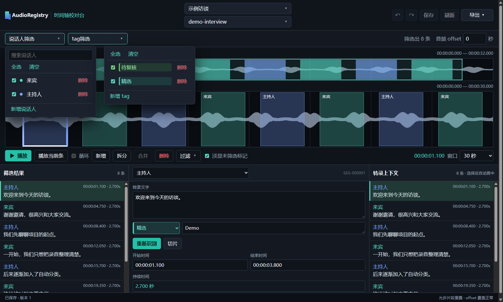
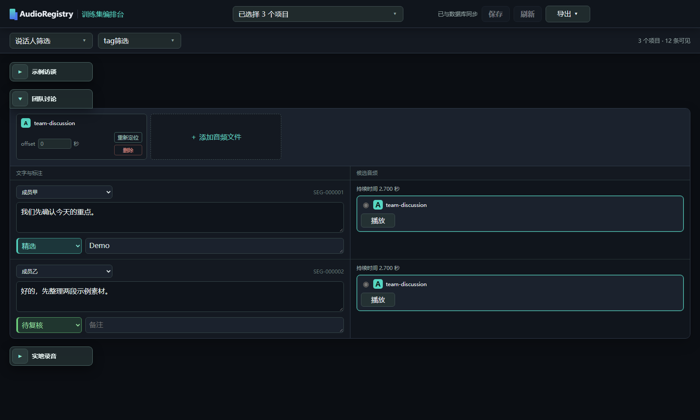

# AudioRegistry

**将多说话人音频，整理成可校对、可筛选、可导出的语音素材库。**

**简体中文** · [English](docs/en/README.md) · [日本語](docs/jp/README.md)

AudioRegistry 在本地完成说话人分段、语音转录、时间线校对和多项目素材组合。原始音频留在原来的位置；项目、时间坐标和标注保存在本地 SQLite 数据库中。

## 功能亮点

### 自动区分说话人，生成可编辑的初稿

使用 pyannote.audio 找出不同说话人的语音区间，并按说话人归类；使用 faster-whisper 为区间生成文字。说话人标签、时间坐标和转录结果都能在后续人工校对，也可借助字幕辅助修正文稿。

用于说话人分段的音频预期是经过处理的纯人声（vocals-only）音轨。可以使用 UVR5 等人声分离工具，从混合音频中提取这样的音轨。

### WebUI1：沿着时间线校对每一句话

在波形上查看说话人区间，按说话人或标签筛选，逐段修改时间、文字、标签和备注。需要时可以重新转录单个片段。对已有项目的编辑先留在页面，点击**保存**后才写入数据库。



### WebUI2：跨项目挑选、组合与导出

把多个项目放到同一页面，按说话人、标签和项目快速筛选用于音频训练的素材，选择音频版本并调整偏移。整理完成后，可将选中的片段与对应文本批量导出，也可导出转录列表和电子表格。



## 快速安装

目前面向 Windows 10/11。以下是默认的 NVIDIA GPU 安装方式：在仓库根目录打开 PowerShell，依次执行。首次使用说话人模型前，先在 Hugging Face 接受 `pyannote/speaker-diarization-community-1` 的使用条款。

```powershell
powershell.exe -NoProfile -ExecutionPolicy Bypass -File .\setup.ps1
& .\.venv\Scripts\hf.exe auth login
powershell.exe -NoProfile -ExecutionPolicy Bypass -File .\scripts\download-models.ps1 -Target all
```

安装完成后，双击 `start.bat` 即可进入完整流程。使用 CPU、Conda 或自备 Python / FFmpeg 的配置步骤见[安装指南（英语）](docs/en/installation.md)；无论采用哪种方式，分段与转录所需的两个模型都需要下载。

## 使用流程

1. **创建项目：** 在项目中心绑定一个或一批音频。项目会立即加入本地数据库，新项目默认勾选；也可以先建立没有分段的项目，再手工编辑。
2. **分段与转录：** 点击**下一步**，已勾选项目会预选在处理窗口。按需调整后开始处理，或直接**跳过**。
3. **校对与标注：** 两个 WebUI 随后打开。WebUI1 默认显示最后处理的项目；逐段修正说话人、时间和文字，点击**保存**提交修改。任一 WebUI 保存项目修改后，另一个 WebUI 若正在查看该项目，会检测到更新并点亮**刷新**按钮；点击即可同步修改。
4. **组合与导出：** 在 WebUI2 查看所选项目，筛选并组合需要的条目，导出切片、列表或电子表格。

以后只想继续校对或导出时，双击 `webui.bat`，即可直接打开两个 WebUI，无需重新经过项目创建和分段转录步骤。用户数据库、音频、模型、缓存和输出文件都不会作为仓库源码提交。

AudioRegistry 源码采用 [MIT 许可证](LICENSE)；依赖和模型各自遵循其许可与使用条款。
