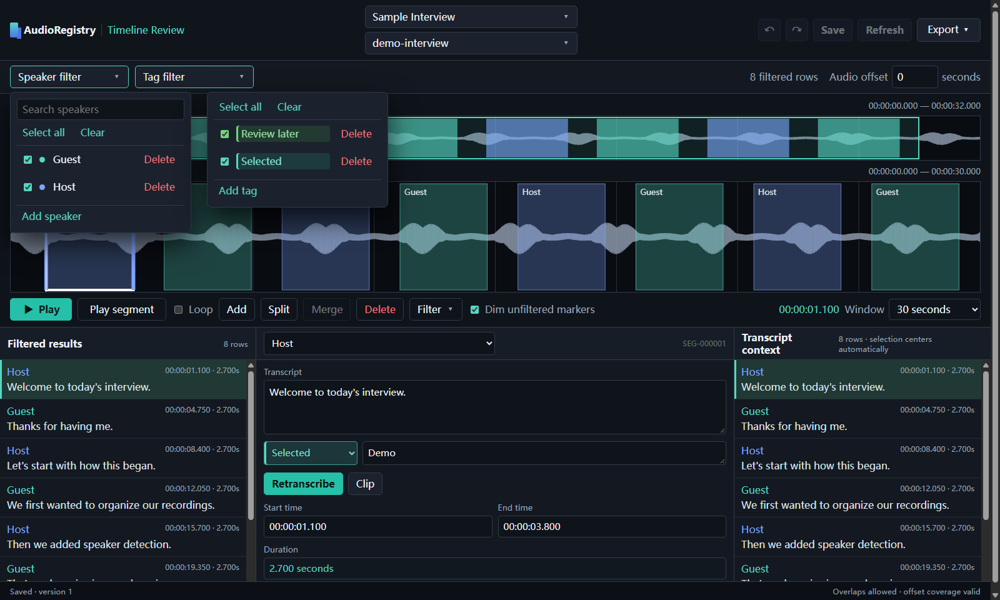
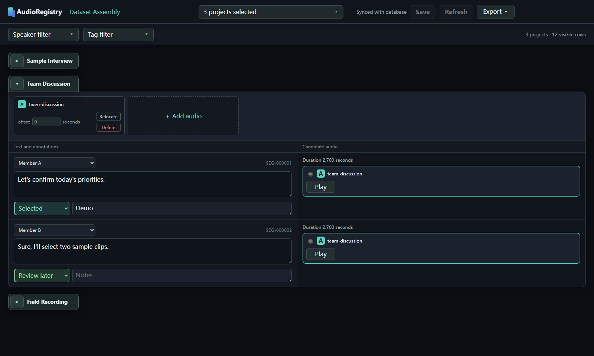

# AudioRegistry

**Turn multi-speaker audio into a speech material library you can review, filter, and export.**

[简体中文](../../README.md) · **English** · [日本語](../jp/README.md)

AudioRegistry connects speaker diarization, transcription, manual review, cross-project filtering, and clip export in one repeatable local workflow. Source audio stays where it is; project records, time coordinates, and annotations live in a local SQLite database.

## Features

### Separate speakers automatically, then refine the first pass

pyannote.audio finds speech intervals and groups them by speaker; faster-whisper creates draft transcripts. You can correct speaker labels, timing, and text afterward, with optional subtitle-assisted alignment.

For speaker diarization, AudioRegistry expects a processed vocals-only audio track. You can extract one from a mix with a vocal separation tool such as UVR5.

### WebUI1: review every line on a timeline

See speaker turns over the waveform, filter by speaker or tag, and edit timing, text, tags, and notes for each segment. Retranscribe an individual segment when needed. Changes to existing project data stay in the page until you click **Save**.



### WebUI2: assemble and export across projects

Bring multiple projects into one view and quickly filter material for audio training by speaker, tag, and project. Choose audio variants, adjust offsets, and export the selected clips with their text, a transcript list, or a spreadsheet.



## Quick install

AudioRegistry currently targets Windows 10/11. The commands below set up the default NVIDIA GPU configuration. Open PowerShell in the repository root and run them in order. Before using the speaker model, accept the terms for `pyannote/speaker-diarization-community-1` on Hugging Face.

```powershell
powershell.exe -NoProfile -ExecutionPolicy Bypass -File .\setup.ps1
& .\.venv\Scripts\hf.exe auth login
powershell.exe -NoProfile -ExecutionPolicy Bypass -File .\scripts\download-models.ps1 -Target all
```

Once setup finishes, double-click `start.bat` to enter the guided workflow. For CPU, Conda, or your own Python and FFmpeg, see the [installation guide](installation.md). Both models used for diarization and transcription must be downloaded in every setup.

## From recording to export

1. **Create projects:** Bind one or many recordings in the project center. Projects are written to the local database immediately, and new ones are checked by default. You can also create a project with no segments and edit it manually later.
2. **Diarize and transcribe:** Click **Next** to open the processing step with checked projects preselected. Adjust the selection and start processing, or choose **Skip**.
3. **Review and annotate:** Both WebUIs open afterward. WebUI1 starts with the last processed project when processing occurred. Correct speakers, timing, and text segment by segment, then click **Save**. When either WebUI saves project changes, the other detects updates to that project if it is open there and lights up its **Refresh** button; click it to sync the changes.
4. **Assemble and export:** In WebUI2, review the selected projects, filter and combine entries, then export clips, a list, or a spreadsheet.

To resume review or export later, double-click `webui.bat`. It opens both WebUIs directly, without repeating project creation or processing. User databases, audio, models, caches, and output files are excluded from the source repository.

AudioRegistry source code is under the [MIT License](../../LICENSE). Dependencies and models retain their own licenses and terms.
