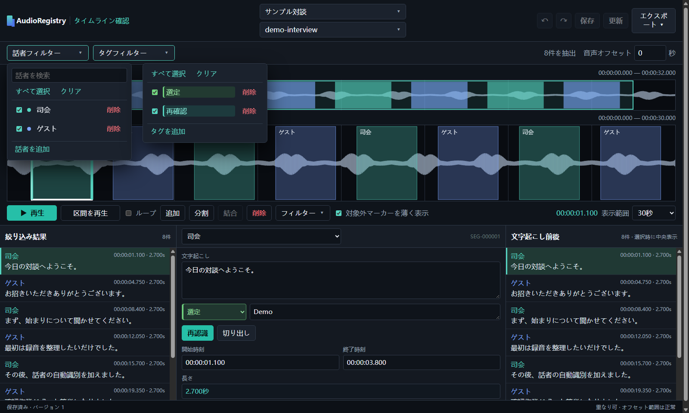
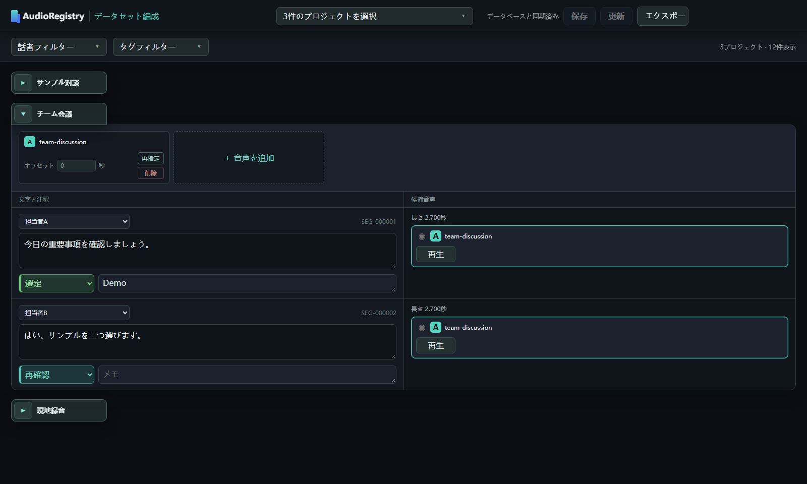

# AudioRegistry

**複数の話者がいる音声を、確認・絞り込み・出力ができる音声素材ライブラリへ。**

[简体中文](../../README.md) · [English](../en/README.md) · **日本語**

AudioRegistry は、話者分離、文字起こし、人手による確認と修正、プロジェクトをまたぐ絞り込み、音声クリップの出力を、繰り返し使える一連のローカル作業にまとめます。元の音声は移動せず、プロジェクト情報、時間座標、注釈をローカルの SQLite データベースに保存します。

## 主な機能

### 話者を自動で区別し、編集できる下書きを生成

pyannote.audio が発話区間を検出して話者ごとに分類し、faster-whisper が文字起こしの下書きを作ります。話者名、時間、テキストは後から修正でき、字幕を使ったテキストの補正にも対応します。

話者分離には、前処理済みのボーカルのみの音声トラックを想定しています。UVR5 などのボーカル分離ツールを使い、ミックス音声から取り出せます。

### WebUI1：タイムラインで一つずつ確認

波形上の話者区間を見ながら、話者やタグで絞り込み、各区間の時間、テキスト、タグ、メモを編集できます。必要な区間だけを再文字起こしすることもできます。既存プロジェクトの変更は、**保存** をクリックするまでページ内に保持されます。



### WebUI2：複数のプロジェクトを組み合わせて出力

複数のプロジェクトを一つの画面に並べ、話者・タグ・プロジェクトで音声学習用の素材をすばやく絞り込めます。音声のバリエーションやオフセットを選び、選んだクリップと対応するテキスト、文字起こしのリスト、表計算ファイルを出力できます。



## クイックインストール

現在は Windows 10/11 を対象としています。以下は NVIDIA GPU を使う標準構成です。リポジトリのルートで PowerShell を開き、順番に実行してください。話者モデルを使う前に、Hugging Face で `pyannote/speaker-diarization-community-1` の利用条件に同意してください。

```powershell
powershell.exe -NoProfile -ExecutionPolicy Bypass -File .\setup.ps1
& .\.venv\Scripts\hf.exe auth login
powershell.exe -NoProfile -ExecutionPolicy Bypass -File .\scripts\download-models.ps1 -Target all
```

設定が完了したら、`start.bat` をダブルクリックして一連の手順を始められます。CPU、Conda、または自分で用意した Python と FFmpeg を使う場合は、[インストールガイド（英語）](../en/installation.md)を参照してください。どの構成でも、話者分離と文字起こしに使う二つのモデルをダウンロードする必要があります。

## 録音から出力まで

1. **プロジェクトを作成：** プロジェクトセンターで一つまたは複数の音声を登録します。プロジェクトはすぐにローカルデータベースへ保存され、新規プロジェクトは最初から選択されます。区間のないプロジェクトを作り、後から手動で編集することもできます。
2. **話者分離と文字起こし：** **次へ** をクリックすると、選択済みのプロジェクトが処理画面で初期選択されます。対象を調整して処理を始めるか、**スキップ** を選びます。
3. **確認と注釈：** 続いて二つの WebUI が開きます。処理した場合、WebUI1 は最後に処理したプロジェクトを表示します。話者、時間、テキストを区間ごとに修正し、**保存** をクリックします。どちらかの WebUI でプロジェクトの変更を保存すると、もう一方でもそのプロジェクトを表示している場合は更新を検知して **更新** ボタンが点灯します。クリックすると変更が反映されます。
4. **構成と出力：** WebUI2 で選択したプロジェクトを確認し、必要な項目を絞り込んで組み合わせ、クリップ、リスト、表計算ファイルとして出力します。

後で確認や出力を再開するときは、`webui.bat` をダブルクリックしてください。プロジェクト作成や処理を繰り返さずに、二つの WebUI を直接開けます。ユーザーのデータベース、音声、モデル、キャッシュ、出力ファイルはソースリポジトリに含まれません。

AudioRegistry のソースコードは [MIT ライセンス](../../LICENSE)で公開されています。依存ライブラリとモデルには、それぞれのライセンスと利用条件が適用されます。
